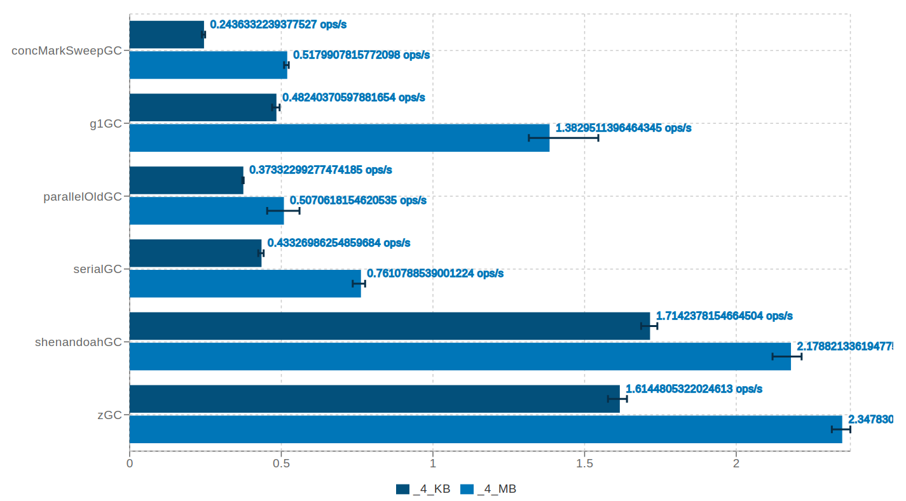
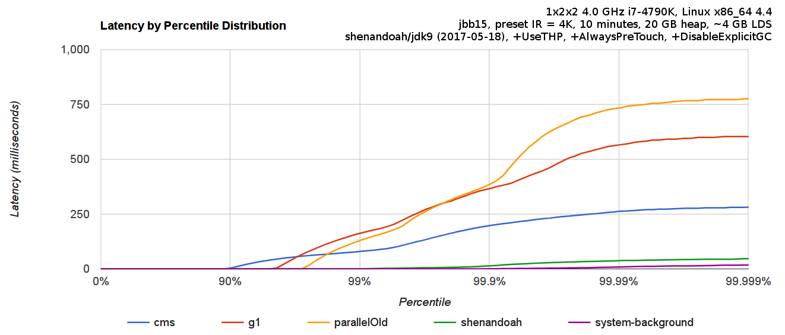

# Garbage Collection

Feb 2021

Takashi Idobe

---

- Imagine you have your own room, and you have to take out the trash every once in a while.
- That's basically garbage collection.

---

## Strategies

- No GC
- Reference Counting
- Mark-Sweep
- Multi-Space

---

## No GC

- We allocate a chunk of memory up front, and when we use it all up, we crash.
- At the end, we throw everything away.

---

## Visualization

- Black = Memory not in use
- Green + Yellow = Memory in Use
- Gray = Memory not in use for long time.

---

---

### Usage

- High Frequency Traders do this a lot.

### Pros

- Fast and Simple

### Cons

- We can't free anything.
- Memory Fragmentation.

---

## Reference Counting

- Keep track of how many times you're using a resource.
- When it drops to 0, free it.

---

---

### Usage

- Obj-C, Swift, Rust, C++

### Pros

- Easy to retrofit
- Simple?

### Cons

- Can't handle cyclic structures (like Graphs)
- Counters aren't thread-safe, so perf hit.
- Can trigger large GC pauses on frequently referenced data.

---

### Mark Sweep Collector

- Every once in a while, pause the program's execution, and see if objects are reachable.
- If reachable, mark as reachable.
- If not reachable, reclaim.

---

---

### Usage

- Lisp, Java, etc.

### Pros

- Less overhead than RC.
- No counting required

### Cons

- Fragmentation
- Can trigger large GC pauses when there's a large amount of data.

---

### Mark Compact

- Mark-Sweep, but compacts memory after sweep.
- This requires an extra sweep to figure out where to put items.

---

---

### Usage

- Lisp, Java, etc.

### Pros

- Less Fragmentation
- Better Performance?

### Cons

- GC Pauses are longer than Mark-Sweep.

---

### Copying Collector

- People figured out that young objects tend to be freed more than older objects.
- Create an area for young objects and one for old objects.
- Check the young area more often, and move young objects to the old area when some time has passed.

---

---

### Usage

- Lisp, Java, etc.

### Pros

- Fewer Sweeps
- Less Fragmentation

### Cons

- Memory might take more time to be freed.
- Requires moving memory around.

---

### GC Throughput

---

### Pause Duration

---

## Takeaways

- GC performance can vary wildly based on what GC you choose.
- Pick one that suits your workload.
- It's hard to make a general purpose GC.
