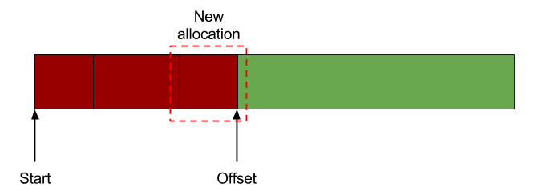

## Memory Allocators

## Feb 2021

## Takashi Idobe

---

## Why Malloc?

- Sometimes we want to have dynamic memory
- We use `malloc` and `free`.
- Malloc has to cover a wide variety of use cases
  - It's not really good at any one thing.
- It can be slow, because sometimes it needs to `sbrk`, and that takes a long time.

Let's build our own memory allocator.

---

## Linear Allocator

- Allocate a big chunk of memory
- Have a pointer to the beginning of the chunk.
- When you need some memory, move the pointer to the end of the point.
- Done!

---

---

### Pros

- This is as fast as possible.

### Cons

- No `free`.
- You have to free the whole thing at once.

Wouldn't it be nice to be able to `free`?

---

## Stack Allocator

- Allocate a big chunk of memory
- Have a pointer to the beginning
- When you need some memory, allocate a small header + memory.
- The header tells us the size of the chunk.
- When freeing, read the header size, free memory, and move backwards that size.

---

---

### Pros

- Still fast

### Cons

- We can free the last chunk (pop the stack).

---

### Pool Allocator

- Allocate a chunk of memory
- Split big memory into smaller chunks of the same size
- When allocating, give a random chunk.
- When freeing, return chunk to pool.
- We store a linked list inside the pool to tell us where the next allocation is.

---
