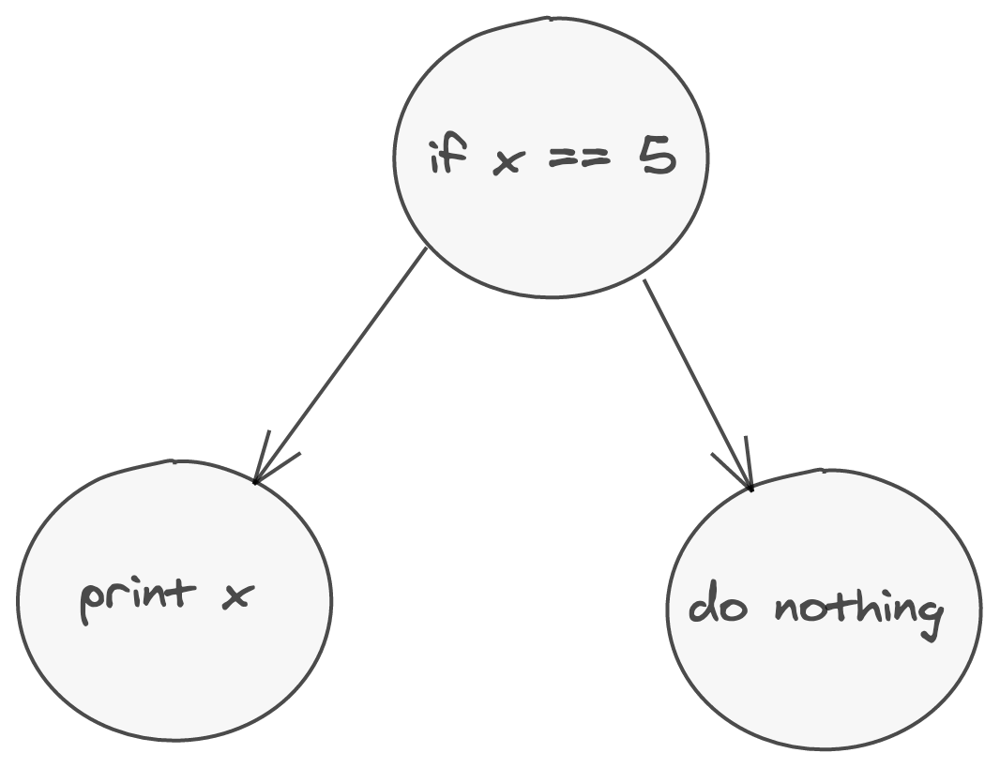

## Refactoring

### Jan 2021

### Takashi Idobe

---

### First, a Definition

Refactoring is a disciplined technique for restructuring an existing body of code, altering its internal structure without changing its external behavior. Its heart is a series of small behavior preserving transformations.

---

### Migrating from Python 2 to 3

```py
def greet(name):
    print "Hello, {0}!".format(name)
print "What's your name?"
name = raw_input()
greet(name)
```

```sh
2to3 greet.py
```

<!-- .element: class="fragment" -->

```py
def greet(name):
    print("Hello, {0}!".format(name))
print("What's your name?")
name = input()
greet(name)
```

<!-- .element: class="fragment" -->

---

### Why not regex?

```c
if (x == 5) {
  puts(x);
}
```

```c
if (x == 5)
  puts(x);
```

<!-- .element: class="fragment" -->

---

Two different ways of representing this AST.


---

## How do we solve this?

With parsers

(Specifically parser combinators)

---

### What are Parser Combinators?

Here's a JSON parser definition:

```rs
#[derive(Debug, PartialEq)]
pub enum JsonValue {
    Str(String),
    Boolean(bool),
    Num(f64),
    Array(Vec<JsonValue>),
    Object(HashMap<String, JsonValue>),
}
```

---

```rs
fn parse_whitespace<'a>(i: &'a str) -> IResult<&'a str, &'a str, VerboseError<&'a str>> {
    let chars = " \t\r\n";

    take_while(move |c| chars.contains(c))(i)
}
```

---

```rs
fn parse_str<'a>(i: &'a str) -> IResult<&'a str, &'a str, VerboseError<&'a str>> {
    escaped(alphanumeric, '\\', one_of("\"n\\"))(i)
}
```

---

```rs
fn parse_bool<'a>(i: &'a str) -> IResult<&'a str, bool, VerboseError<&'a str>> {
    let parse_true = value(true, tag("true"));
    let parse_false = value(false, tag("false"));

    alt((parse_true, parse_false))(i)
}
```

---

```rs
fn parse_string<'a>(i: &'a str) -> IResult<&'a str, &'a str, VerboseError<&'a str>> {
    context(
        "string",
        preceded(char('\"'), cut(terminated(parse_str, char('\"')))),
    )(i)
}
```

---

```rs
fn parse_array<'a>(i: &'a str) -> IResult<&'a str, Vec<JsonValue>, VerboseError<&'a str>> {
    context(
        "array",
        preceded(
            char('['),
            cut(terminated(
                separated_list0(preceded(parse_whitespace, char(',')), json_value),
                preceded(parse_whitespace, char(']')),
            )),
        ),
    )(i)
}
```

---

```rs
fn key_value<'a>(i: &'a str) -> IResult<&'a str, (&'a str, JsonValue), VerboseError<&'a str>> {
    separated_pair(
        preceded(parse_whitespace, parse_string),
        cut(preceded(parse_whitespace, char(':'))),
        json_value,
    )(i)
}
```

---

```rs
fn parse_hash<'a>(
    i: &'a str,
) -> IResult<&'a str, HashMap<String, JsonValue>, VerboseError<&'a str>> {
    context(
        "map",
        preceded(
            char('{'),
            cut(terminated(
                map(
                    separated_list0(preceded(parse_whitespace, char(',')), key_value),
                    |tuple_vec| {
                        tuple_vec
                            .into_iter()
                            .map(|(k, v)| (String::from(k), v))
                            .collect()
                    },
                ),
                preceded(parse_whitespace, char('}')),
            )),
        ),
    )(i)
}
```

---

```rs
fn json_value<'a>(i: &'a str) -> IResult<&'a str, JsonValue, VerboseError<&'a str>> {
    preceded(
        parse_whitespace,
        alt((
            map(parse_hash, JsonValue::Object),
            map(parse_array, JsonValue::Array),
            map(parse_string, |s| JsonValue::Str(s.to_string())),
            map(double, JsonValue::Num),
            map(parse_bool, JsonValue::Boolean),
        )),
    )(i)
}
```

---

```rs
fn root<'a>(i: &'a str) -> IResult<&'a str, JsonValue, VerboseError<&'a str>> {
    delimited(
        parse_whitespace,
        alt((
            map(parse_hash, JsonValue::Object),
            map(parse_array, JsonValue::Array),
        )),
        opt(parse_whitespace),
    )(i)
}
```

---

We throw all of the parsers together, and then define the general structure of our JSON:

JSON can start with a hash (an object) or a alternatively, an array.
We don't care about whitespace at all.

---

We can use parser combinators to create a general language for refactoring:
Let's see it in action.

---

Let's try replacing the fields of a rust struct with shorthand syntax:

```rs
let bar: u8 = 123;
struct Foo {
    bar: u8,
}
let foo = Foo { bar: bar };
```

```rs
let bar: u8 = 123;
struct Foo {
    bar: u8,
}
let foo = Foo { bar };
```

[Link](https://comby.live/#{%22substitution_kind%22:%20%22in_place%22,%20%22language%22:%20%22.rs%22,%20%22rewrite%22:%20%22{%20:[field]%20}%22,%20%22rule%22:%20%22where%20:[field]%20==%20:[use]\n%22,%20%22source%22:%20%22let%20bar:%20u8%20=%20123;\nstruct%20Foo%20{\n%20%20%20%20bar:%20u8,\n}\nlet%20foo%20=%20Foo%20{%20bar:%20bar%20};\n%22,%20%22id%22:%200,%20%22match%22:%20%22{%20:[[field]]:%20:[[use]]%20}%22})

---

What about in Ruby?

```rb
{"key" => "value"}
```

Replace with shorthand symbol syntax:

```rb
{key: "value"}
```

[Link](https://bit.ly/3iI2EZn)

---

Multiline version:

```rb
{"foo" => "bar","baz" => "qux",
"newline" => "lol"
}
```

```rb
{foo: "bar",baz: "qux",
newline: "lol"
}
```

[Link](https://bit.ly/2YaBYHc)

---

We also have to fix all callers:

```rb
m = {"key" => "value"}
m["key"] # "value"
```

```rb
m = {key: "value"}
m[:key] # "value"
```

[Link](https://bit.ly/36aMh29)

---

How about in C?

```c
if (x == 5)
  puts(str);
```

```c
if (x == 5) {
  puts(x);
}
```

[Link](https://bit.ly/3iIpujx)

---

Use the docs:

```sh
https://comby.dev/
```

Installating `comby`?

```sh
brew install comby
```
