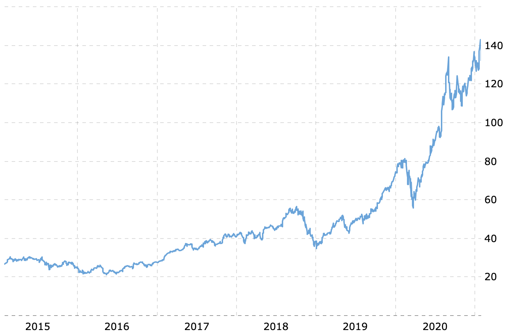

# Typeclasses

Jan 2021

Takashi Idobe

---

<iframe width="807" height="454" src="https://www.youtube.com/embed/xE5EcHuz52I?start=843&end=879" frameborder="0" allow="accelerometer; autoplay; clipboard-write; encrypted-media; gyroscope; picture-in-picture" allowfullscreen></iframe>

---

Apple invented protocol-oriented programming:

_Protocol Oriented Programming in Swift_

by Dave Abrahams

- "Protocols are central to Swift"
- "Protocols make it easy to extend classes, that's why we made Swift the first protocol oriented programming language"

---

[Audio](./assets/output.mp3)

---

I watched a video today on Swift ... about 'protocol oriented programming' ... and they basically just introduced typeclasses and they were like 'We invented this, it's amazing'

---

### Typeclasses in Haskell

Haskell from 1988

```hs
class Eq a where
  (==) :: a -> a -> Bool
  (/=) :: a -> a -> Bool
  x == y = not (x /= y)
  x /= y = not (x == y)
```

---

```hs
data Point = Point Float Float deriving(Show, Eq)
```

```hs
Prelude> Point 1 2
Point 1.0 2.0
Prelude> Point 1 2 == Point 1 2
True
Prelude> Point 2 1 /= Point 1 2
True
```

---

[Typeclasses in 1988](https://people.csail.mit.edu/dnj/teaching/6898/papers/wadler88.pdf)

---

### Protocols in Swift

Swift in 2018

```swift
protocol IsEqual {
    static func == (lhs: Self, rhs: Self) -> Bool
    static func != (lhs: Self, rhs: Self) -> Bool
}
```

```swift
struct Point : Equatable {
    var x: Double
    var y: Double
}
```

```swift
print(Point(x: 1, y: 2) == Point(x: 1, y: 2)) // true
print(Point(x: 2, y: 1) != Point(x: 1, y: 2)) // true
```

---

If you're 30 years late, you must be the first to implement it

Apple has great marketing

---

What does this print out in go?

```go
func main() {
  x := 1
  y := 2
  z := math.Min(x, y)
  fmt.Println(z)
}
```

FAIL: cannot use a (type int) as type float64 in argument to math.Min

---

[Wat](https://www.destroyallsoftware.com/talks/wat)

---

### Generics in C++

```cpp
auto add(auto a, auto b) { return a + b; }
```

I've never said that these types were addable.

```cpp
add("hello", 2);
```

---

### Concepts in C++

```cpp
template <NumericType T>
auto add(T a, T b) -> T { return a + b; }
```

---

### Numeric types in Swift

```swift
func add<T:Numeric>(a: T, b: T) -> T {
    a + b
}
```

---

### Typeclasses in Rust

```rs
fn add<T: std::ops::add>(a: T, b: T) -> T {
  a + b
}
```

---

### Typeclasses in Haskell

```hs
class Num a where
  add :: a -> a -> a
```

---

### Shapes in Haskell

```hs
class Shape a where
  name :: a -> String
  area :: a -> Float
  perimeter :: a -> Float

data Circle = Circle {r :: Float}
data Rectangle = Rectangle {w :: Float, h :: Float}

instance Shape Circle where
  name (Circle _) = "Circle"
  area (Circle r) = pi * r ^ 2
  perimeter (Circle r) = 2 * pi * r

instance Shape Rectangle where
  name (Rectangle _ _) = "Rectangle"
  area (Rectangle w h) = w * h
  perimeter (Rectangle w h) = 2 * w * 2 * h

printArea :: Shape a => a -> IO()
printArea s = putStrLn("My area is: " ++ show (area s) ++ "\n")

main = do
  printArea $ Circle 10
  printArea $ Rectangle 10 20
```

---

### Shapes in Swift

```swift
protocol Shape {
    func name() -> String;
    func area() -> Float;
    func perimeter() -> Float;
}

struct Rectangle : Shape {
    let l: Float;
    let w: Float;
    init(l: Float, w: Float) { self.l = l; self.w = w; }
    func name() -> String { "Rectangle" }
    func area() -> Float { l * w }
    func perimeter() -> Float { 2 * (l * w) }
}

struct Circle : Shape {
    let r: Float;
    init(r: Float) { self.r = r; }
    func name() -> String { "Circle" }
    func area() -> Float { r * r * Float.pi }
    func perimeter() -> Float { 2 * Float.pi * r }
}

func print_area(s: Shape) { print(s.get_area()) }

func main() {
    print_area(s: Circle(r: 10))
    print_area(s: Rectangle(l: 10, w: 20))
}
```

---

### Shapes in Rust

```rs
use std::fmt::Debug;

trait Shape {
    fn get_name(&self) -> String;
    fn get_area(&self) -> f32;
    fn get_perimeter(&self) -> f32;
}

#[derive(Debug)]
struct Circle {
    r: f32,
    name: String,
}

impl Circle {
    fn new(r: f32) -> Circle {
        Circle {
            r,
            name: "Circle".to_string(),
        }
    }
}

impl Shape for Circle {
    fn get_name(&self) -> String {
        self.name.clone()
    }

    fn get_area(&self) -> f32 {
        self.r * self.r * 3.14
    }

    fn get_perimeter(&self) -> f32 {
        self.r * 2.0 * 3.14
    }
}

#[derive(Debug)]
struct Rectangle {
    l: f32,
    w: f32,
    name: String,
}

impl Rectangle {
    fn new(l: f32, w: f32) -> Rectangle {
        Rectangle {
            l,
            w,
            name: "Rectangle".to_string(),
        }
    }
}

impl Shape for Rectangle {
    fn get_name(&self) -> String {
        self.name.clone()
    }

    fn get_area(&self) -> f32 {
        self.l * self.w
    }

    fn get_perimeter(&self) -> f32 {
        (self.l + self.w) * 2.0
    }
}

fn print_area<T>(t: T)
where
    T: Shape + Debug,
{
    println!("{:?}", t);
}

fn main() {
    let circle = Circle::new(10.0);
    println!("{}", circle.get_perimeter());
    let rectangle = Rectangle::new(10.0, 20.0);
    println!("{}", rectangle.get_perimeter());
    print_area(rectangle);
    print_area(circle);
}
```

---

### Shapes in C++

```cpp
#include <iostream>
#include <string>

class Shape {
public:
  virtual std::string getName() = 0;
  virtual double getPerimeter() = 0;
  virtual double getArea() = 0;

private:
  std::string name_ = "Shape";
};

class Rectangle : public Shape {
public:
  Rectangle(double l, double w) : l_(l), w_(w) {}
  std::string getName() { return name_; }
  double getPerimeter() { return 2 * (l_ + w_); }
  double getArea() { return l_ * w_; }

private:
  std::string name_ = "Rectangle";
  double l_;
  double w_;
};

class Circle : public Shape {
public:
  Circle(double r) : r_(r) {}
  std::string getName() { return name_; }
  double getPerimeter() { return 2 * r_ * 3.14; }
  double getArea() { return r_ * r_ * 3.14; }

private:
  std::string name_ = "Circle";
  double r_;
};

void printArea(Shape &shape) { std::cout << shape.getArea() << std::endl; }

int main() {
  Rectangle r = Rectangle(10, 20);
  Circle c = Circle(10.0);
  printArea(c);
  printArea(r);
}
```

---

### Shapes in C

```c
#include <stdio.h>

enum Shape_Type { CIRCLE, RECTANGLE };

struct Shape {
  enum Shape_Type shape_type;
  union {
    struct {
      double l;
      double w;
    };
    struct {
      double r;
    };
  };
  char *(*getName)(struct Shape);
  double (*getArea)(struct Shape);
  double (*getPerimeter)(struct Shape);
};

char *getName(struct Shape s) {
  if (s.shape_type == CIRCLE)
    return "Circle";
  else if (s.shape_type == RECTANGLE)
    return "Rectangle";
  else
    return "Shape";
}

double getArea(struct Shape s) {
  if (s.shape_type == CIRCLE)
    return s.r * s.r * 3.14;
  else if (s.shape_type == RECTANGLE)
    return (s.l + s.w) * 2;
  return 0;
}

double getPerimeter(struct Shape s) {
  if (s.shape_type == CIRCLE)
    return s.r * 2 * 3.14;
  else if (s.shape_type == RECTANGLE)
    return s.l * s.w;
  return 0;
}

struct Shape makeShape() {
  struct Shape s = {
      .getName = getName, .getArea = getArea, .getPerimeter = getPerimeter};
  return s;
}

struct Shape makeCircle(double r) {
  struct Shape c = makeShape();
  c.shape_type = CIRCLE;
  c.r = r;
  return c;
}

struct Shape makeRectangle(double l, double w) {
  struct Shape r = makeShape();
  r.shape_type = RECTANGLE;
  r.l = l;
  r.w = w;
  return r;
}

int main() {
  struct Shape c = makeCircle(10);
  printf("My perimeter is: %f\n", c.getPerimeter(c));
  printf("My area is: %f\n", c.getArea(c));
  printf("My name is: %s\n", c.getName(c));
  struct Shape r = makeRectangle(20, 40);
  printf("My perimeter is: %f\n", r.getPerimeter(r));
  printf("My area is: %f\n", r.getArea(r));
  printf("My name is: %s\n", r.getName(r));
}
```

---

### Lessons Learned

[OCaml at Cornell](https://www.cs.cornell.edu/courses/cs3110/2019sp/textbook/intro/ocaml.html)

Genealogically, OCaml comes from the line of programming languages whose grandfather is Lisp and includes modern languages such as Clojure, F#, Haskell, and Racket. Functional languages have a surprising tendency to predict the future of more mainstream languages. Java brought garbage collection into the mainstream in 1995; Lisp had it in 1958. Java didn't have generics until version 5 in 2004; the ML family had it in 1990.

---

First-class functions and type inference have been incorporated into mainstream languages like Java, C#, and C++ over the last 10 years, long after functional languages introduced them. By studying functional programming, you get a taste of what might be coming down the pipe next. Who knows what it might be? (My bet would be pattern matching.)

---

#### Apple's Stock Price since 2015



---

### Takeways

- Don't trust Apple's marketing
- Swift has a pretty nice protocol system
- People like to take ideas from functional programming and say they did it first.
